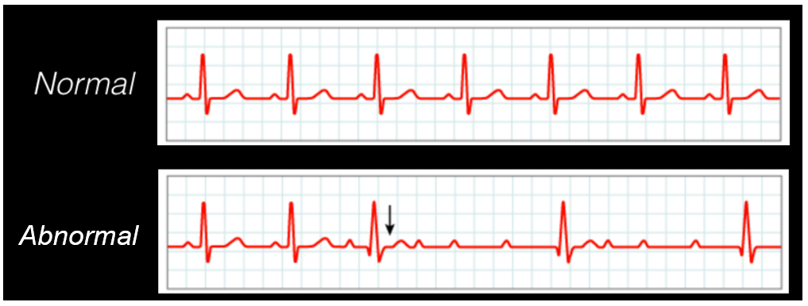

# Context
The repository contains code and resources for a project aimed at classifying different types of cardiac abnormalities using ECG signals. The project focuses on developing automated systems capable of detecting abnormalities in ECG signals, which are essential for constant monitoring of patients. The main goal of this project is to build a robust classification model using machine learning methods.

# Dataset
We will use the dataset [ECG5000](https://timeseriesclassification.com/description.php?Dataset=ECG5000) with 7600 training data and 1900 test data.

Each data contains a cardiac cycle with 140 samples, and that can belong to one of 5 categories:

1. Normal
2. Abnormal: premature ventricular contraction
3. Abnormal: premature supraventricular contraction
4. Abnormal: ectopic beat
5. Abnormal: but unknown pathology

The problem with the ECG5000 set is that it contains 4427 normal data and 3173 abnormal data, that is, it is unbalanced.

In fact, for certain abnormal categories (2 to 5) there are very few data:

| Category    |  Samples|
|-------------|------------|
| 1 (normal)  | 4427       |
| 2 (abnormal) | 2683       |
| 3 (abnormal) | 149        |
| 4 (abnormal) | 306        |
| 5 (abnormal) | 35         |

We can see that the critical case is category 5 with only 35 samples. We need an approach capable of correctly classifying these data.

# Requirements
1. numpy
2. fastai
3. sklearn
4. matplotlib.pyplot
5. imblearn
6. tsai
7. pandas
8. seaborn

# Models
The repository includes a Jupyter Notebook that provides a step-by-step implementation of the classification pipeline [here](Classifying_cardiac_abnormalities_with_inception_time.ipynb). It covers data exploration, preprocessing, model training using the [Inception Time architecture]((https://towardsdatascience.com/deep-learning-for-time-series-classification-inceptiontime-245703f422db)), and evaluation of the model's performance. Additionally, an alternative approach using the EasyEnsemble algorithm with a Random Forest classifier is also presented for comparison. The model got an accurracy of 94.12. It is available for download in the [inception_time_1.pkl](inception_time_1.pkl) file.

# Try the model
To test the implemented models you should download the file [inception_time_1.pkl](inception_time_1.pkl) and [app.py](app.py). Put them in the same folder and run the app.py script. This will display a gradio interface on a localhost for easy use of the model.

