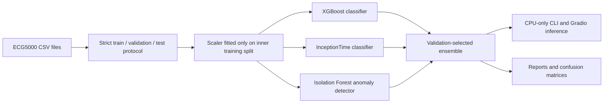

# ECG5000 Cardiac Abnormality Classification


This repository presents a reproducible research pipeline for classifying
ECG5000 heartbeat segments into five cardiac classes. The system compares an
InceptionTime neural model, a class-aware XGBoost classifier, an Isolation
Forest anomaly detector, and a validation-selected ensemble.

The emphasis is not inflated accuracy. The project prioritizes leakage-safe
evaluation, transparent model selection, minority-class reporting, and simple
CPU-only inference.

> This is a research and education project. It is not a clinically validated
> diagnostic tool and must not be used for medical decision-making.

## Highlights

| Area | What this project does |
|---|---|
| Dataset | ECG5000, 140 time samples per heartbeat, five labels |
| Supervised models | InceptionTime and XGBoost |
| Anomaly model | Isolation Forest trained only on normal beats |
| Ensemble | Validation-selected probability ensemble with anomaly signal support |
| Evaluation | Official ECG5000 test split reserved for final evaluation |
| Inference | Batch CLI and minimal Gradio app, both CPU-only |
| Documentation | Full English docs in [`docs/index.md`](docs/index.md) |

## Current Test Results

Final metrics were computed once on the official ECG5000 test split after
validation-based model selection.

| Model | Accuracy | Macro-F1 | Balanced accuracy | Notes |
|---|---:|---:|---:|---|
| XGBoost | 0.9863 | 0.9092 | 0.8840 | Strongest supervised model |
| InceptionTime | 0.9021 | 0.6078 | 0.7509 | Trained on Kaggle GPU, reported separately |
| Isolation Forest | 0.9363 | 0.9353 | 0.9440 | Binary normal-vs-anomaly evaluation |
| Ensemble | 0.9863 | 0.9092 | 0.8840 | Validation selected XGBoost weight 1.00 |

See the curated results page at
[`docs/results/model-results.md`](docs/results/model-results.md) and the
generated report at [`reports/model_results.md`](reports/model_results.md).

## System Overview


```mermaid
flowchart LR
    A["ECG5000 CSV files"] --> B["Strict train / validation / test protocol"]
    B --> C["Scaler fitted only on inner training split"]
    C --> D["XGBoost classifier"]
    C --> E["InceptionTime classifier"]
    C --> F["Isolation Forest anomaly detector"]
    D --> G["Validation-selected ensemble"]
    E --> G
    F --> G
    G --> H["CPU-only CLI and Gradio inference"]
    G --> I["Reports and confusion matrices"]
```

## Quick Start

Create an environment and install the core dependencies:

```powershell
python -m venv .venv
.\.venv\Scripts\Activate.ps1
pip install -r requirements.txt
```

Train the local models, select the ensemble, and regenerate the report:

```powershell
python -m src.train_xgboost
python -m src.train_isolation_forest
python -m src.train_ensemble
python -m src.evaluate
```

For InceptionTime support, install the optional dependencies:

```powershell
pip install -r requirements-inception.txt
```

Retrain InceptionTime on Kaggle GPU and copy the exported CPU artifact locally:

```powershell
python scripts\run_kaggle_inception.py --submit --wait --download --copy-artifacts
python -m src.train_ensemble
python -m src.evaluate
```

Run CPU-only batch inference:

```powershell
python -m src.predict --input path\to\beats.csv --output predictions.csv
```

Separate InceptionTime columns are skipped by default for fast CPU inference.
Add `--include-inception` only when you explicitly want that slower neural
baseline output.

Launch the simple Gradio interface:

```powershell
python app.py
```

## Dataset Classes

| Label | Meaning |
|---:|---|
| 1 | Normal |
| 2 | Premature ventricular contraction |
| 3 | Premature supraventricular contraction |
| 4 | Ectopic beat |
| 5 | Unknown abnormal pathology |

## Documentation

Start with [`docs/index.md`](docs/index.md). The documentation is organized for
three common reading paths:

- Reviewers: project overview, results, limitations.
- Researchers: experimental protocol, preprocessing, model methodology.
- Implementers: setup, training, inference, troubleshooting.

Key pages:

- [`docs/methodology/experimental-protocol.md`](docs/methodology/experimental-protocol.md)
- [`docs/models/ensemble.md`](docs/models/ensemble.md)
- [`docs/reproducibility/training.md`](docs/reproducibility/training.md)
- [`docs/reproducibility/inference.md`](docs/reproducibility/inference.md)
- [`docs/ethics-and-limitations.md`](docs/ethics-and-limitations.md)

## Repository Layout

```text
dataset/             ECG5000 train and test CSV files
src/                 Training, evaluation, inference, metrics, and artifact code
kaggle_inception/    Kaggle GPU script for InceptionTime retraining
scripts/             Automation helpers
models/              Saved model artifacts
reports/             Generated metrics and confusion matrices
docs/                Human-readable project documentation
tests/               Leakage and pipeline guard tests
```

## Reproducibility Principles

- The official test split is never used for preprocessing, early stopping,
  threshold selection, or ensemble selection.
- The scaler is fitted only on the inner training fold.
- XGBoost uses class-aware sample weights computed from training labels only.
- Isolation Forest is trained only on normal class samples.
- InceptionTime is reported honestly even when the final ensemble assigns it
  zero weight.
- CPU-only inference loads saved artifacts and performs no fitting.
