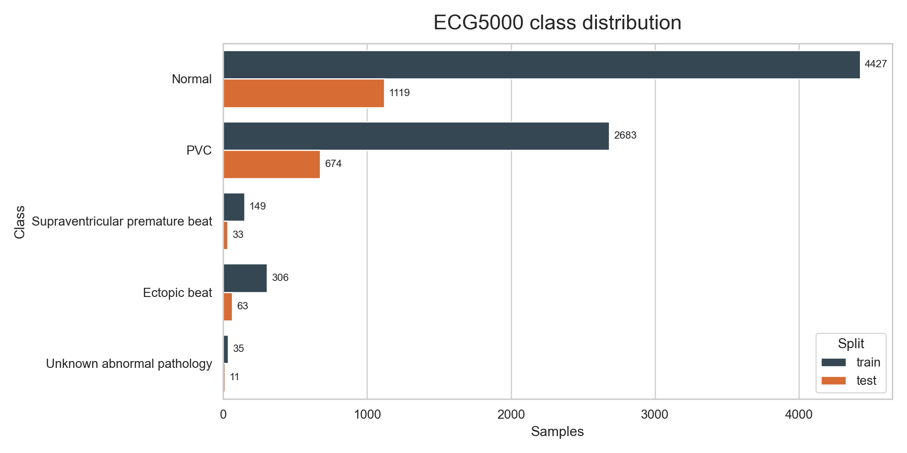
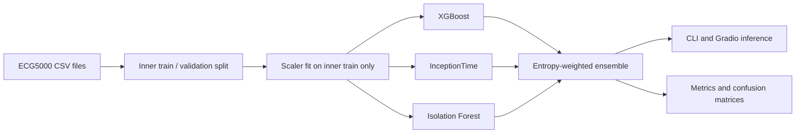
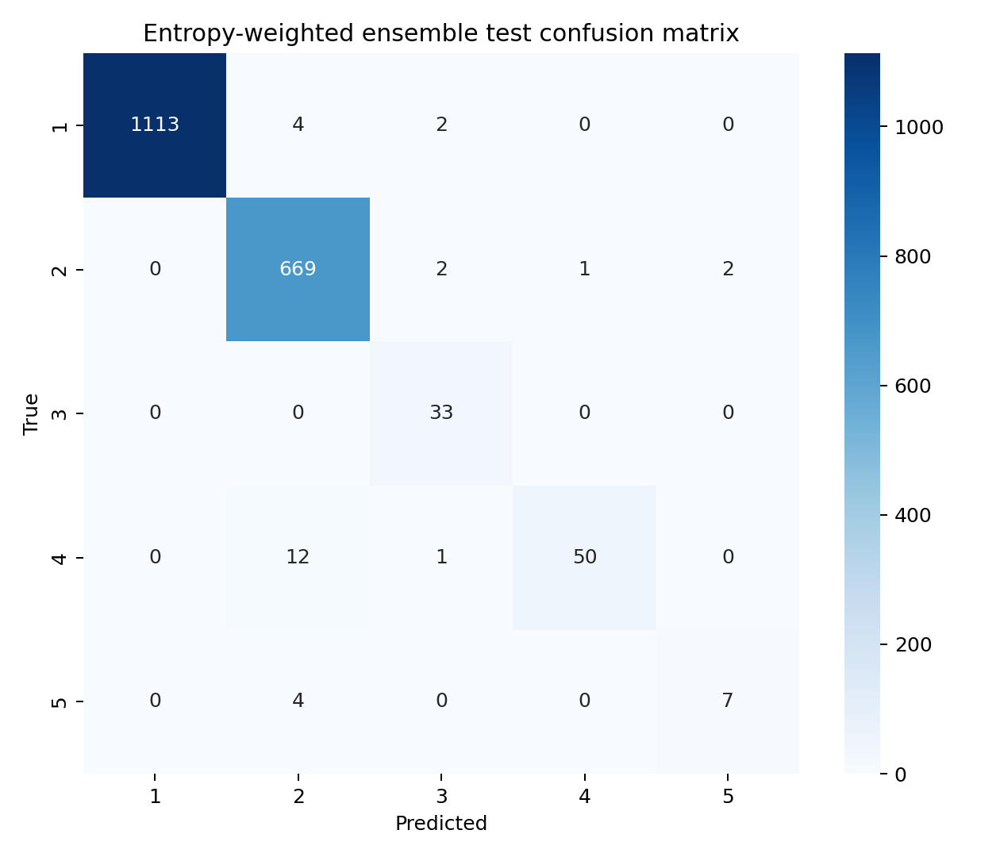
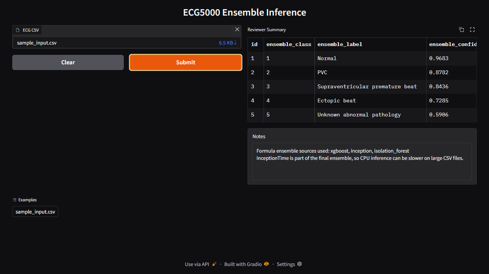

# ECG-Based Cardiac Abnormality Classification with Ensemble Learning


This repository presents a reproducible research pipeline for classifying
ECG5000 heartbeat signal patterns into five benchmark classes. It compares an
InceptionTime neural time-series model, a class-aware XGBoost classifier, an
Isolation Forest anomaly detector, and a transparent entropy-weighted ensemble.

The project is designed for academic portfolio review: it emphasizes
leakage-safe evaluation, minority-class reporting, reproducible artifacts, and a
lightweight Gradio interface for CPU-only inference.

> This project is a research/educational prototype. It is not clinically
> validated and must not be used for medical diagnosis or patient management.

## Overview

ECG classification is a strong applied machine learning setting because it
combines biomedical time-series data, class imbalance, and high evaluation risk.
The main contribution here is not a single headline accuracy number; it is a
documented workflow that separates training, validation, final test evaluation,
artifact reuse, and deployable inference.

## Problem

The task is to classify each heartbeat segment into one of the five ECG5000
classes. The repository uses safe language intentionally: the model classifies
benchmark signal patterns and should be interpreted as a decision-support
experiment, not a clinical product.

## Dataset

The project uses the ECG5000 benchmark dataset. Each row contains one heartbeat
segment with 140 time samples. The repository includes the official train and
test CSV files in `dataset/`.

ECG5000 stores preprocessed, normalized single-heartbeat vectors rather than
full clinical ECG strips, so the README focuses on dataset distribution and
evaluation artifacts instead of presenting those vectors as clinical-looking ECG
traces.

| Split | Samples | Use |
|---|---:|---|
| Official train | 7,600 | Inner train/validation split, preprocessing fit, model selection |
| Official test | 1,900 | Final evaluation only |

| Label | Meaning |
|---:|---|
| 1 | Normal |
| 2 | Premature ventricular contraction |
| 3 | Premature supraventricular contraction |
| 4 | Ectopic beat |
| 5 | Unknown abnormal pathology |



## Methodology

The pipeline uses a strict train/validation/test policy:

1. Load the official ECG5000 train split.
2. Create an inner stratified train/validation split.
3. Fit `MinMaxScaler` only on the inner training fold.
4. Train candidate models and select thresholds/weights using validation only.
5. Evaluate once on the official ECG5000 test split.
6. Save reusable model, scaler, report, and inference artifacts.


```mermaid
flowchart LR
    A["ECG5000 CSV files"] --> B["Inner train / validation split"]
    B --> C["Scaler fit on inner train only"]
    C --> D["XGBoost"]
    C --> E["InceptionTime"]
    C --> F["Isolation Forest"]
    D --> G["Entropy-weighted ensemble"]
    E --> G
    F --> G
    G --> H["CLI and Gradio inference"]
    G --> I["Metrics and confusion matrices"]
```

## Models

| Model | Role |
|---|---|
| XGBoost | Strongest individual supervised classifier on the current test split |
| InceptionTime | Neural time-series baseline trained on Kaggle GPU and exported for CPU inference |
| Isolation Forest | Normal-vs-anomaly detector trained only on normal beats |
| Ensemble | Final transparent formula using positive contributions from all three model families |

The final project narrative is deliberately honest: XGBoost is the best
individual five-class model in the current experiment, while the ensemble is the
final research design because it combines complementary model signals through a
documented validation-selected formula.

## Class Imbalance Strategy

ECG5000 is imbalanced. Class 5 has only 35 training samples and 11 test samples,
so accuracy alone can be misleading. The project therefore reports macro-F1,
balanced accuracy, per-class recall, and confusion matrices alongside accuracy.

The imbalance controls include:

- Stratified inner train/validation split.
- Class-aware XGBoost sample weights.
- Class-weighted InceptionTime training.
- Normal-only Isolation Forest anomaly modeling.
- Validation-only ensemble and threshold selection.

## Results

Final metrics were computed once on the official ECG5000 test split after
validation-based model selection.

| Model | Accuracy | Macro-F1 | Balanced accuracy | Interpretation |
|---|---:|---:|---:|---|
| XGBoost | 0.9863 | 0.9092 | 0.8840 | Best individual supervised model |
| InceptionTime | 0.9021 | 0.6078 | 0.7509 | Neural time-series baseline |
| Isolation Forest | 0.9363 | 0.9353 | 0.9440 | Binary normal-vs-anomaly evaluation |
| Ensemble | 0.9853 | 0.8971 | 0.8834 | Final transparent three-model formula |

Per-class recall on the official test split:

| Model | Normal | PVC | Supraventricular | Ectopic | Unknown abnormal |
|---|---:|---:|---:|---:|---:|
| XGBoost | 0.9946 | 0.9955 | 1.0000 | 0.7937 | 0.6364 |
| InceptionTime | 0.9410 | 0.8798 | 0.8485 | 0.5397 | 0.5455 |
| Ensemble | 0.9946 | 0.9926 | 1.0000 | 0.7937 | 0.6364 |



Detailed results are available in [`docs/results/model-results.md`](docs/results/model-results.md)
and [`reports/model_results.md`](reports/model_results.md). Machine-readable
metrics are stored in [`reports/metrics_all_test.json`](reports/metrics_all_test.json).

## Demo

The Gradio interface accepts a CSV with 140 feature columns, or 141 columns when
the first column is an ECG5000 label. Labels are ignored during inference. The
UI shows a compact reviewer summary with predicted class, label, confidence, and
anomaly probability.



Launch the demo:

```powershell
python app.py
```

Example files:

- [`examples/sample_input.csv`](examples/sample_input.csv) contains one
  feature-only heartbeat row per ECG5000 class.
- [`examples/sample_output.csv`](examples/sample_output.csv) was generated with
  the public batch inference command.

## Installation

Create an environment and install the core dependencies:

```powershell
python -m venv .venv
.\.venv\Scripts\Activate.ps1
pip install -r requirements.txt
```

Install optional InceptionTime dependencies when loading or retraining the
exported FastAI/tsai learner locally:

```powershell
pip install -r requirements-inception.txt
```

## Usage

Train the local models, select the ensemble, and regenerate the report:

```powershell
python -m src.train_xgboost
python -m src.train_isolation_forest
python -m src.train_ensemble
python -m src.evaluate
```

Run CPU-only batch inference:

```powershell
python -m src.predict --input examples\sample_input.csv --output predictions.csv
```

Retrain InceptionTime on Kaggle GPU and copy the exported CPU artifact locally:

```powershell
python scripts\run_kaggle_inception.py --submit --wait --download --copy-artifacts
python -m src.train_ensemble
python -m src.evaluate
```

Verify the environment:

```powershell
pytest -q
python -m pytest -q
```

## Repository Structure

```text
assets/              Portfolio visuals used by the README
dataset/             Official ECG5000 train and test CSV files
docs/                Structured project documentation
examples/            Sample inference input and generated output
kaggle_inception/    Kaggle GPU script for InceptionTime retraining
models/              Saved model and preprocessing artifacts
notebooks/           Cleaned exploratory notebook, kept as secondary material
reports/             Generated metrics and confusion matrices
scripts/             Automation helpers
src/                 Training, evaluation, inference, metrics, and artifacts
tests/               Leakage, preprocessing, inference, and UI guard tests
```

## Academic Relevance

This project explores automated ECG-based cardiac signal classification using
time-series deep learning and classical machine learning. It focuses on
imbalanced biomedical data, leakage-safe model evaluation, interpretable
reporting, and deployable inference through a lightweight Gradio interface.

For scholarship or academic review, it demonstrates:

- Biomedical signal processing context.
- Time-series classification with InceptionTime.
- Imbalanced classification evaluation beyond accuracy.
- Reproducible artifacts and tests.
- Responsible clinical limitations and documentation.

## Limitations

- ECG5000 is a benchmark dataset and does not establish clinical readiness.
- Classes 3 and 5 have very small support, so minority metrics can change with a
  few examples.
- InceptionTime inference is slower on CPU than the XGBoost path.
- The Isolation Forest component is a binary anomaly signal and does not
  identify abnormal subtype by itself.
- External validation on broader ECG data would be required before any clinical
  interpretation.

See [`MODEL_CARD.md`](MODEL_CARD.md) and
[`docs/ethics-and-limitations.md`](docs/ethics-and-limitations.md) for the full
responsible-use summary.

## References

- ECG5000 dataset description: [Time Series Classification website](https://timeseriesclassification.com/description.php?Dataset=ECG5000)
- InceptionTime paper: [InceptionTime: Finding AlexNet for Time Series Classification](https://arxiv.org/abs/1909.04939)
- tsai library: [timeseriesAI/tsai](https://github.com/timeseriesAI/tsai)
- fastai library: [fast.ai](https://www.fast.ai/)

## License

This project is released under the MIT License. See [`LICENSE`](LICENSE).
