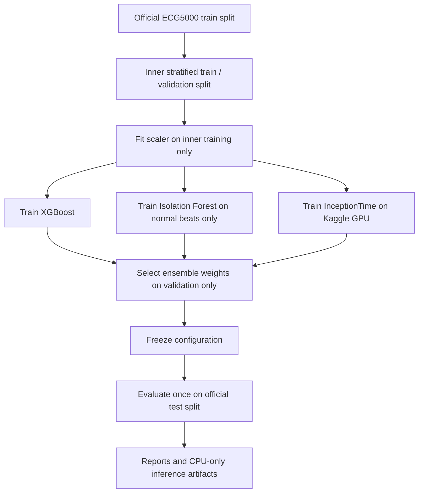

# Documentation Index

This documentation describes a reproducible ECG5000 research pipeline for
five-class cardiac abnormality classification. It complements the concise
project entry point in [`../README.md`](../README.md).

## Reading Paths

| Reader | Recommended path |
|---|---|
| Reviewer | [Project overview](project/overview.md), [results](results/model-results.md), [ethics and limitations](ethics-and-limitations.md) |
| Researcher | [Experimental protocol](methodology/experimental-protocol.md), [data preprocessing](methodology/data-preprocessing.md), [model pages](#model-documentation) |
| Implementer | [Setup](reproducibility/setup.md), [training](reproducibility/training.md), [inference](reproducibility/inference.md), [troubleshooting](reproducibility/troubleshooting.md) |

## Project Documentation

| Page | Purpose |
|---|---|
| [Overview](project/overview.md) | Motivation, dataset, task definition, and high-level limitations |
| [Repository structure](project/repository-structure.md) | Explanation of folders, generated artifacts, and source modules |
| [Ethics and limitations](ethics-and-limitations.md) | Clinical disclaimer, dataset limits, and minority-class cautions |

## Methodology

| Page | Purpose |
|---|---|
| [Experimental protocol](methodology/experimental-protocol.md) | Train/validation/test policy and anti-leakage controls |
| [Data preprocessing](methodology/data-preprocessing.md) | CSV format, label handling, scaling, and inference validation |

## Model Documentation

| Page | Purpose |
|---|---|
| [InceptionTime](models/inception-time.md) | Kaggle GPU training, CPU export, validation behavior |
| [XGBoost](models/xgboost.md) | Objective, class weighting, early stopping, and metrics |
| [Isolation Forest](models/isolation-forest.md) | Normal-only training and anomaly evaluation |
| [Ensemble](models/ensemble.md) | Validation-only model selection and final weights |

## Results And Reproducibility

| Page | Purpose |
|---|---|
| [Model results](results/model-results.md) | Curated metrics and interpretation |
| [Setup](reproducibility/setup.md) | Environment and dependency installation |
| [Training](reproducibility/training.md) | Exact commands for local and Kaggle training |
| [Inference](reproducibility/inference.md) | CLI and Gradio usage with CPU-only behavior |
| [Troubleshooting](reproducibility/troubleshooting.md) | Common Kaggle, dependency, and Windows issues |

## Current Artifacts

| Artifact | Description |
|---|---|
| [`../models/scaler.joblib`](../models/scaler.joblib) | Scaler fitted only on the inner training split |
| [`../models/xgboost_model.json`](../models/xgboost_model.json) | XGBoost classifier |
| [`../models/isolation_forest.joblib`](../models/isolation_forest.joblib) | Isolation Forest anomaly detector |
| [`../models/inception_cpu.pkl`](../models/inception_cpu.pkl) | Exported InceptionTime learner for CPU inference |
| [`../models/ensemble_config.json`](../models/ensemble_config.json) | Validation-selected ensemble configuration |
| [`../reports/model_results.md`](../reports/model_results.md) | Generated evaluation report |

## Experiment Flow

