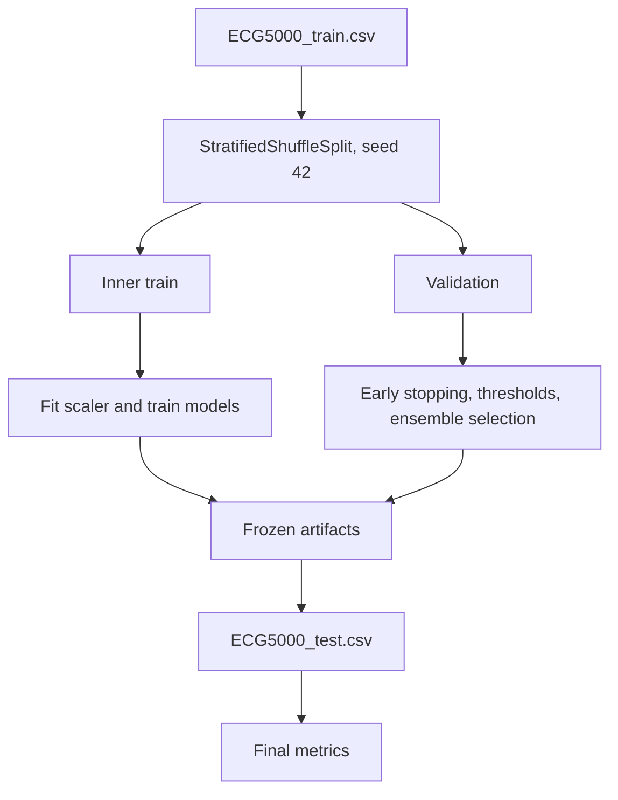

# Experimental Protocol

The project uses a conservative evaluation protocol. The goal is to report
credible metrics, even when that means documenting modest results for some
models.

## Splits

| Split | Source | Purpose |
|---|---|---|
| Inner train | Stratified split from `ECG5000_train.csv` | Fit scaler, train models, compute class weights |
| Validation | Stratified split from `ECG5000_train.csv` | Early stopping, threshold selection, ensemble selection |
| Test | Official `ECG5000_test.csv` | Final evaluation only |

The inner train/validation split is produced with `StratifiedShuffleSplit`,
fixed seed `42`, and validation size `0.2`.

## Anti-Leakage Controls

| Control | Why it matters |
|---|---|
| Test split is held out | Prevents tuning to final evaluation data |
| Scaler is fitted only on inner train | Prevents validation/test distribution leakage |
| XGBoost class weights use only inner train labels | Prevents label distribution leakage |
| InceptionTime early stopping uses validation only | Prevents test-guided neural training |
| Isolation Forest is trained only on normal training beats | Preserves anomaly detection framing |
| Ensemble weights are selected on validation only | Prevents test-optimized blending |

## Model Selection

The ensemble selection criterion is validation macro-F1, with balanced accuracy
used as a tie-breaker. The selected configuration is saved to
`models/ensemble_config.json` before final test evaluation.

The current frozen ensemble is an entropy-weighted three-model formula. XGBoost,
InceptionTime, and Isolation Forest all have positive base weights, and
per-sample entropy adjusts their dynamic contribution. Validation selects the
positive base weights; the official test split is not used for this selection.

## Final Evaluation

Final metrics are computed by `python -m src.evaluate`. The script evaluates
available artifacts on the official test split and writes:

| Output | Purpose |
|---|---|
| `reports/model_results.md` | Human-readable report |
| `reports/metrics_all_test.json` | Combined machine-readable metrics |
| `reports/metrics_*_test.json` | Per-model metrics |
| `reports/confusion_matrix_*_test.png` | Per-model confusion matrices |

## Protocol Diagram

